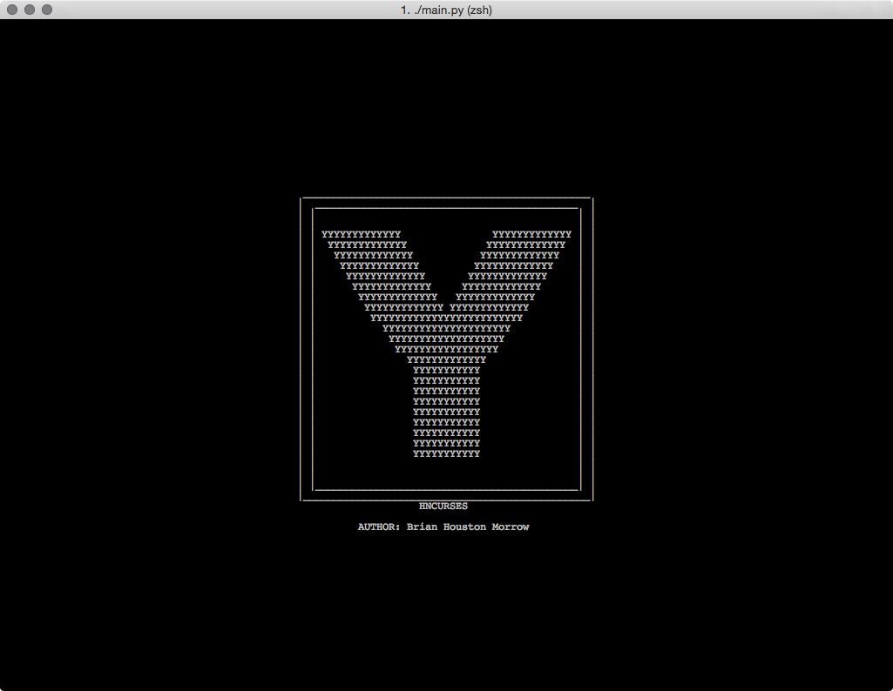
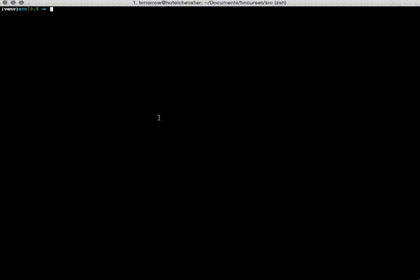

hncurses
========

hncurses offers a basic terminal interface for browsing Hacker News.





##requirements
python-requests
python-requests-futures

##installation
```
pip install requests
pip install requests-futures
python setup.py install
```
##use
- (j): scroll down
- (k): scroll up
- (l): open story link in browser
- (h): open story in HN
- (\<ENTER\>): open comments
- (q): quit
